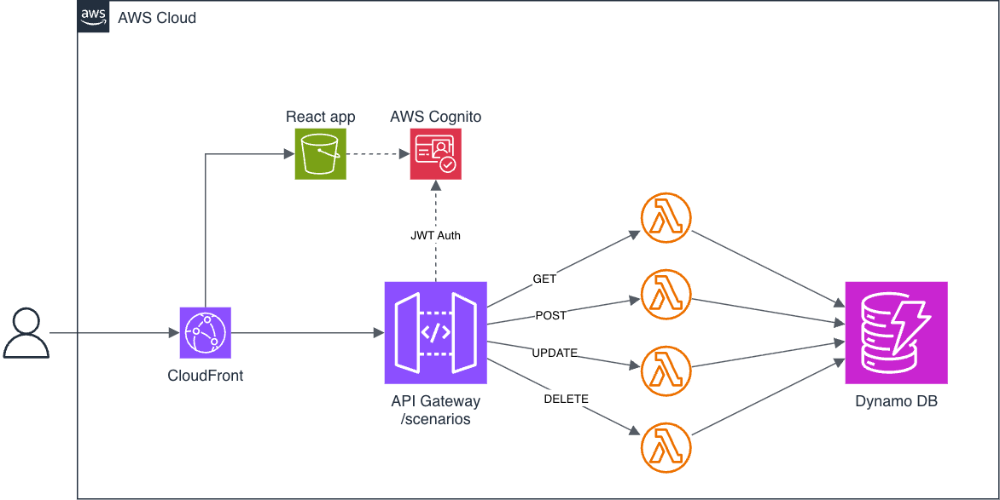

## Project overview

This repository contains a **training project** as part of an internal learning exercise.

The objective is to design and implement a small web application that meets the following requirements:

- Web application supporting CRUD operations
- Persistent data storage
- User authentication restricting access to a selected group of users
- RESTful API for all CRUD operations
- All components hosted in AWS
- Use Infrastructure as Code with AWS CDK to define and deploy cloud resources
- No use of Amplify or AppSync

Based on these requirements, the project models a **Scenarios** service.

## What the Scenarios service does

The Scenarios service is a small internal tool for storing and managing **scenarios that describe business behaviour, edge cases, and testing flows**.

Each scenario captures a clear sequence of steps showing how functionality behaves and how it should be tested across services.

Scenarios are used by:

- developers, to understand system behaviour and business logic
- QA engineers, to follow consistent steps when testing features and edge cases

## Architecture

The application follows a simple, production-like architecture:

- Frontend: React
- Hosting: S3 + CloudFront
- API: API Gateway + AWS Lambda
- Authentication: Amazon Cognito
- Storage: DynamoDB
- Infrastructure as Code: AWS CDK

All cloud resources are defined and deployed using AWS CDK.

---

## Domain model

### Scenario

A Scenario represents a documented flow describing business behaviour, edge cases, or testing steps.

A Scenario contains:

- id
- ticket
- title
- description
- steps
- expectedResult
- components (e.g. ESA, GQT)
- createdBy
- createdAt

Components are treated as metadata and allow a scenario to be associated with multiple systems.

---

## API design

The application exposes **a single REST API** via API Gateway.

The API operates on the `Scenario` resource using standard HTTP methods:

- GET /scenarios  
  Returns a list of all scenarios

- GET /scenarios/{id}  
  Returns a single scenario by its identifier

- POST /scenarios  
  Creates a new scenario

- PUT /scenarios/{id}  
  Updates an existing scenario

- DELETE /scenarios/{id}  
  Deletes a scenario by its identifier

---

## Authentication and access control

Access to the application is restricted to authenticated users.

Authentication is handled using Amazon Cognito.

Authorization rules:

- Developers can create, update, delete, and view scenarios
- QA and product roles have view-only access

User identity is validated before requests reach the backend.

---

## Infrastructure overview

AWS resources include:

- S3 bucket for frontend hosting
- CloudFront distribution for content delivery
- API Gateway for REST API
- Lambda functions for backend logic
- DynamoDB table for scenario storage
- Cognito user pool for authentication

Infrastructure is defined and deployed using AWS CDK.

---

## Implementation plan

The project is implemented step by step, focusing on core functionality first.

### Step 1 – Foundation

- Create repository and basic project structure
- Set up AWS account, IAM user, and budget
- Deploy a minimal React frontend via S3 and CloudFront

---

### Step 2 – Backend API

- Create API Gateway and Lambda
- Define REST endpoints for the Scenario resource
- Implement basic CRUD handlers
- Return mock or static data initially

---

### Step 3 – Persistence

- Add DynamoDB table
- Store and retrieve scenarios from DynamoDB
- Connect CRUD endpoints to persistent storage

---

### Step 4 – Authentication

- Configure Cognito user pool
- Protect API endpoints
- Enforce role-based access rules

---

### Step 5 – Integration and UI

- Extend the frontend with basic UI for viewing and editing scenarios
- Connect frontend to the authenticated API
- Complete end-to-end CRUD flow

---

### Step 6 – Testing (optional)

- Add basic unit tests for Lambda handlers using Vitest
- Validate request and response contracts

---

### Step 7 – Pagination, filtering, and sorting

Avoid returning all records in a single request

- Add pagination to the list endpoint
- Support limits and continuation between requests
- Add simple filtering

---

### Step 8 – Audit logging and observability

Add basic audit logging to record changes made to scenarios.
To understand who changed data and when and simplify debugging and investigation

- Log CREATE, UPDATE, and DELETE actions
- Record which user performed the action
- Store audit records in a separate table

## Current status

### Step 1 – Foundation

- [x] Repository created with frontend and CDK directories
- [x] Initial React application scaffolded and verified locally
- [x] AWS account configured
- [x] Non-root IAM user created for development
- [x] AWS budget configured

### Step 2 – Backend API

- [x] Created RestApiStack to provision the backend infrastructure
- [x] Configured API Gateway with CRUD endpoints for /scenarios and /scenarios/{id}
- [x] Implemented a single Lambda handler to process GET, POST, PUT, DELETE
- [x] Used NodejsFunction with esbuild bundling for deployment
- [x] Deployed the stack and verified the endpoint via Insomnia

### Step 3 – Persistence

- [x] Created a DynamoDB table for Scenario storage
- [x] Added permissions for the Lambda function to read and write data in DynamoDB
- [x] Updated utility functions to use DynamoDB instead of returning mock data
- [x] Verified data persistence and retrieval via API requests

### Step 4 - Authentication

- [x] Added AuthStack with Cognito user pool and user pool client
- [x] Defined role-based access using Cognito groups editors and viewers
- [x] Secured API Gateway endpoints with Cognito authorizer
- [x] Implemented authorization checks in Lambda based on user groups
- [x] Verified authenticated access

### Step 5 – Integration and UI

- [x] Implemented frontend pages for creating, viewing and editing scenarios
- [x] Added delete scenario functionality to the table action menu
- [x] Connected frontend to the backend API using react-query
- [x] Built a reusable add/edit form with validation using react-hook-form and yup
- [x] Implemented loading and error states across all main pages
